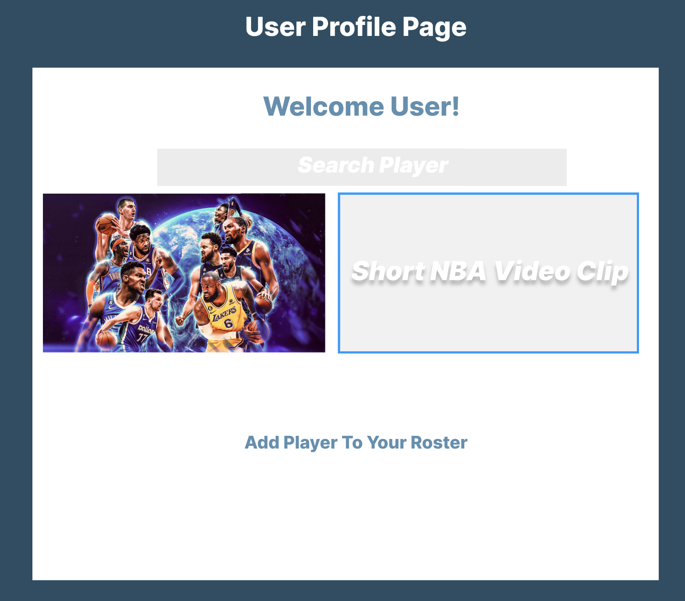

# **IT'S In The Game!!!!**

### It’s In The Game is an interactive application designed for NBA enthusiasts to explore and create their fantasy basketball teams. Users can search through a comprehensive list of NBA players, view details such as their names, teams, positions, and stats, and also select players to a personalized fantasy roster. This application provides a dynamic and engaging platform for fans to create, manage, and optimize their own fantasy basketball teams. 

## Getting Started
- "Insert Link To Deployed App"

## [Wire Frame](https://www.figma.com/design/9eQTQIL1eRyrZ7O7u3Wkj3/IT'S-IN-THE-GAME?node-id=0-1&t=a9y9u0bUY5OasAPF-0)

## Technologies Used

### - [✔] Javascript
### - [✔] HTML
### - [✔] CSS
### - [✔] EJS
### - [✔] Express.js
### - [✔] MongoDB

## Stretch Goals
> ### Invite Users to Fantasy League
>> ### Upload Images Whenever NBA Player Is Searched
>>> ### Add Player Stats For International Players 